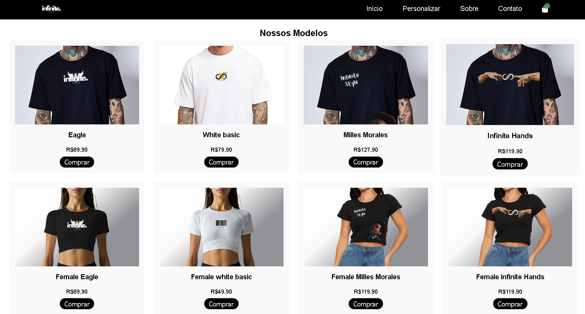
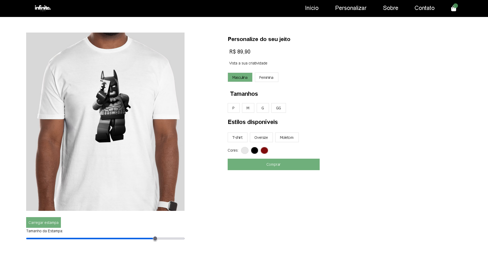
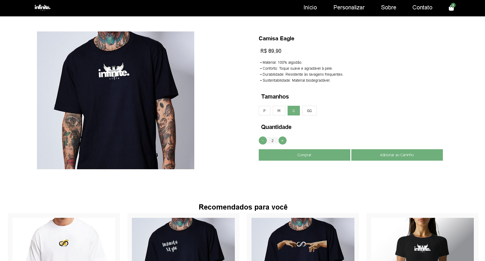

# Infinite Style 👕

Loja de roupas online com sistema de personalização e catálogo dinâmico.

## 🚀 Novas Atualizações
* **Animações de Hover:** Experiência visual aprimorada ao passar o mouse sobre os produtos.
* **Produtos Recomendados:** Sugestões inteligentes baseadas no que você está visualizando.
* **Refinamento de Design:** Melhorias na disposição dos elementos e responsividade.

## 📸 Demonstração do Projeto

### Home Page & Destaques
O carrossel apresenta as principais coleções e novidades da loja.

### Catálogo de Produtos
Interface limpa e organizada para visualização de roupas com animações interativas.

### Sistema de Personalização
Ferramenta exclusiva onde o usuário pode customizar cores, estampas e modelos.

### Experiência de Compra
Visualização detalhada do item e gerenciamento simplificado do carrinho.

* JavaScript (Manipulação de Estado e DOM)
* LocalStorage para persistência do carrinho
