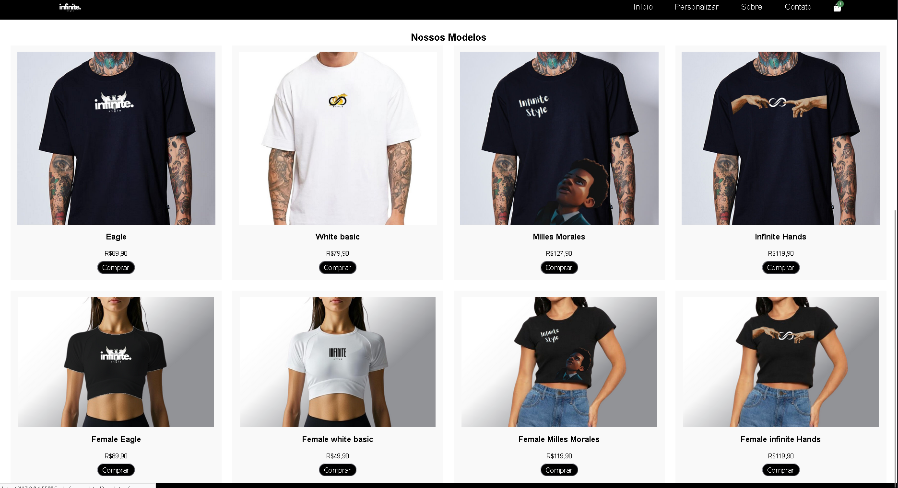

# Infinite Style 👕

Loja de roupas fictícia desenvolvida em HTML, CSS e JavaScript.

## Funcionalidades
- Catálogo com 8 produtos
- Sacola de compras persistente
- Personalização de roupas
- Responsivo para mobile

## Tecnologias
- HTML5
- CSS3
- JavaScript
- localStorage

## Como usar
1. Clone o repositório
2. Abra o `index.html` no navegador
